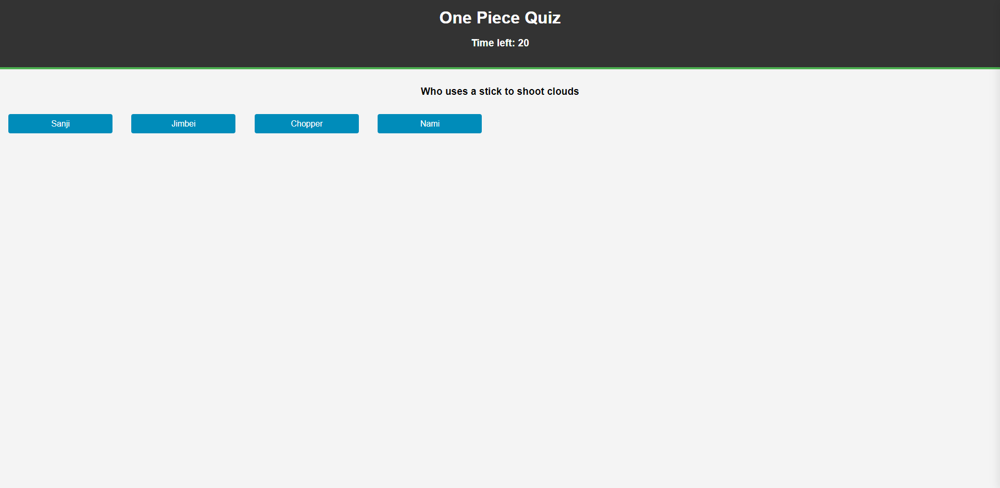
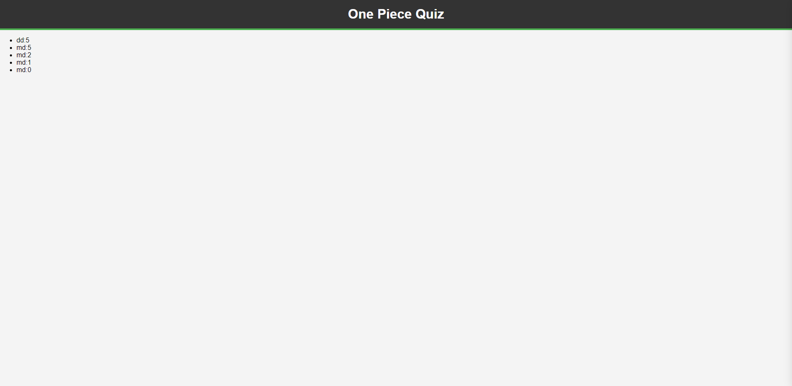

# JavaScript OnePiece Quiz

Test your knowledge on some One Piece!

## Features:

- Timed Quiz.
- Time penalty for wrong answers.
- Save score with initials.

## How it works:

1. Click "start" to begin.
2. answer questions as the come.
3. Wrong answers will reduce your remaining time.
4. Quiz ends when you answer all questions or time runs out.
5. Saves the score and initials.

## Pictures

## Acknowledgements:

Shout-out to OpenAI for checking my code making this not take forever!
